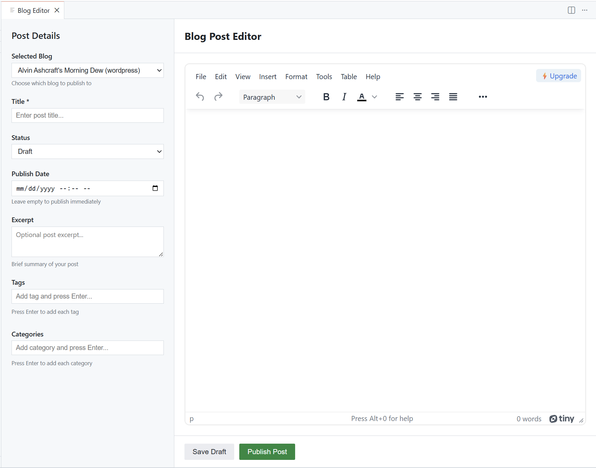
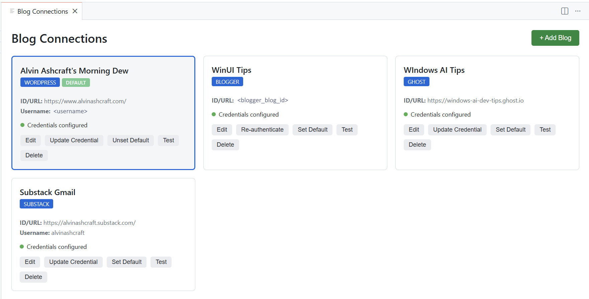
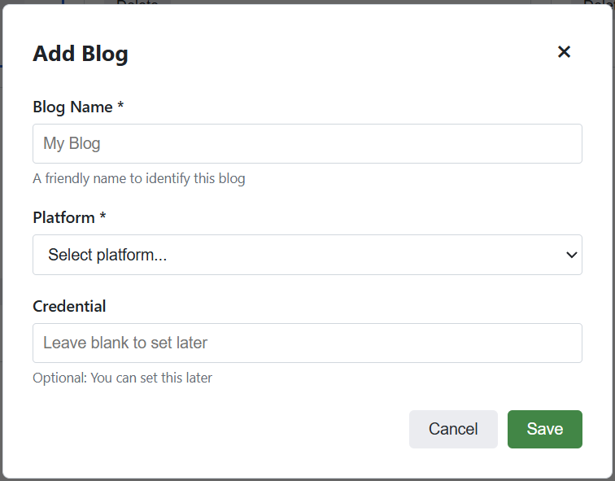

# Live Blog Writer

[](https://marketplace.visualstudio.com/items?itemName=alvinashcraft.live-blog-writer)
[](https://marketplace.visualstudio.com/items?itemName=alvinashcraft.live-blog-writer)
[](https://marketplace.visualstudio.com/items?itemName=alvinashcraft.live-blog-writer)

A VS Code extension for writing and publishing blog posts with built-in HTML and Markdown editors. Supports WordPress, Blogger, Ghost, Substack, and Dev.to.

Full-featured WYSIWYG blog post editor experience:



The blog connections manager screen:



Add a new blog from WordPress, Blogger, Ghost, Substack, or Dev.to:



## Features

- **Dual Editor Modes**: HTML editor (TinyMCE) and Markdown editor (EasyMDE)
- **Markdown Publishing Support**:
  - Publish Markdown directly to Dev.to
  - Publish Markdown to HTML-based platforms via Markdown→HTML conversion at publish time
- **Multi-Platform Support**: Publish to WordPress, Blogger, Ghost, Substack, and Dev.to
- **Multiple Blogs**: Configure and manage multiple blogs across different platforms
- **Visual Blog Management**: Intuitive webview interface for managing all blog connections
- **Default Blog**: Set a default blog for quick publishing
- **Blog Selection**: Choose which blog to publish to directly from the editor
- **Edit Published Posts**: Fetch and edit posts that are already published on your blog
- **Metadata Management**: Easy-to-use left panel for managing post details:
  - Blog selection dropdown
  - Post title
  - Post status (Draft, Published, Pending Review, Private)
  - Publish date/time
  - Post excerpt
  - Tags
  - Categories
- **Draft Management**: Save and manage drafts locally
- **Auto-save**: Automatically saves your work every 30 seconds
- **Secure Credentials**: All passwords, tokens, and API keys stored securely
- **Clean Interface**: Focused writing environment within VS Code

## Installation

1. Install the extension from the [VS Code Marketplace](https://marketplace.visualstudio.com/items?itemName=alvinashcraft.live-blog-writer)
   - Or search for "Live Blog Writer" in VS Code Extensions (Ctrl+Shift+X)
1. Configure your blog credentials using the visual Blog Connections Manager
1. Start writing and publishing!

## Configuration

### Quick Start: Managing Blog Connections

The easiest way to set up your blogs is using the built-in **Blog Connections** visual interface:

1. Open Command Palette (`Ctrl+Shift+P` or `Cmd+Shift+P`)
1. Run: **"Live Blog Writer: Manage Blog Connections"**
1. Click **"+ Add Blog"** button
1. Fill in the form for your platform
1. Optionally set credentials immediately or later

> **NOTE:** Read the [QUICKSTART docs](./docs/QUICKSTART.md) for Substack blog configuration carefully. There are some special steps that must be taken to connect to your Substack account.

The visual interface provides:

- Card-based view of all your blogs
- Status indicators showing which blogs have credentials configured
- One-click default blog selection
- Direct authentication for Blogger OAuth
- Connection testing
- Easy credential management

### Supported Platforms

#### WordPress

- **Requirements**: Site URL, username, application password
- **Command**: "Live Blog Writer: Set WordPress Password"
- **Note**: Supports self-hosted and WordPress.com blogs

#### Blogger

- **Requirements**: Blog ID
- **Command**: "Live Blog Writer: Authenticate with Blogger"
- **Note**: Requires Google authentication

#### Ghost

- **Requirements**: Site URL, Admin API key
- **Command**: "Live Blog Writer: Set Ghost API Key"
- **Setup**: Generate key from Ghost Admin → Settings → Integrations

#### Substack

- **Requirements**: Hostname, connect.sid cookie (recommended) OR email/password
- **Command**: "Live Blog Writer: Set Substack API Key"
- **Setup**: Get cookie from browser DevTools while logged into Substack (recommended) or use email/password (may not work due to API restrictions)
- **Note**: Cookie authentication is more reliable. Enter hostname without `https://` prefix (e.g., `myblog.substack.com`)

#### Dev.to

- **Requirements**: Dev.to API key
- **Command**: "Live Blog Writer: Set Dev.to API Key"
- **Setup**: Create an API key in Dev.to Settings → Account → DEV API Keys
- **Note**: Dev.to publishing requires Markdown content (set "Content format" to Markdown)

### Detailed Setup Guides

For detailed platform-specific setup instructions, see:

- [Blog Connections UI Guide](docs/BLOG_CONNECTIONS_UI.md) - Visual interface for managing blogs
- [Multi-Blog Platform Guide](docs/MULTI_BLOG_GUIDE.md)
- [Markdown Editor Guide](docs/MARKDOWN_EDITOR.md)
- [Dev.to Setup Guide](docs/DEVTO_SETUP.md)
- [Editing Published Posts Guide](docs/EDITING_PUBLISHED_POSTS.md)
- [Migration Guide](docs/MIGRATION_GUIDE.md) (for existing users)

### Legacy Configuration (Deprecated)

The old single-blog configuration still works but is deprecated. Please migrate to the new multi-blog system:

1. Run: "Live Blog Writer: Manage Blog Configurations"
1. Select: "Migrate Legacy Settings"

Old settings format:

```json
{
  "liveBlogWriter.platform": "wordpress",
  "liveBlogWriter.wordpress.url": "https://example.com",
  "liveBlogWriter.wordpress.username": "myusername"
}
```

New settings format:

```json
{
  "liveBlogWriter.blogs": [
    {
      "name": "My Blog",
      "platform": "wordpress",
      "id": "https://example.com",
      "username": "myusername"
    }
  ],
  "liveBlogWriter.defaultBlog": "My Blog"
}
```

## Usage

### Creating a New Blog Post

1. Open the Command Palette (`Ctrl+Shift+P` or `Cmd+Shift+P` on Mac)
1. Type "Live Blog Writer: New Blog Post" and press Enter
1. The blog editor will open in a new panel

### Writing Your Post

1. **Left Panel - Post Details**:
   - **Select Blog**: Choose which blog to publish to from the dropdown
   - **Title**: Enter your post title
   - **Status**: Select the post status (Draft, Published, etc.)
   - **Publish Date**: Optionally set a publish date/time
   - **Excerpt**: Add an excerpt (brief summary)
   - **Tags**: Add tags by typing and pressing Enter
   - **Categories**: Add categories by typing and pressing Enter

1. **Main Editor**:
  - Choose a "Content format":
    - **HTML** (TinyMCE)
    - **Markdown** (EasyMDE)
  - Write your content using the selected editor

### Publishing Your Post

1. **Select your target blog** from the "Selected Blog" dropdown (if not already selected)
1. Click the **"Save Draft"** button to save your work locally
1. Click the **"Publish Post"** button to publish to your selected blog
   - If no blog is selected, you'll be prompted to choose one
1. Or use the Command Palette: "Live Blog Writer: Publish Post"

### Editing Published Posts

You can edit posts that are already published on your blog:

**Method 1: Using the Command Palette**

1. Open the Command Palette (`Ctrl+Shift+P` or `Cmd+Shift+P`)
1. Type "Live Blog Writer: Edit Published Post" and press Enter
1. A post selector popup appears in the editor
1. Select your blog from the dropdown
1. Click on a post to select it, then click "Load Post"
1. Make your changes in the editor
1. Click "Publish Post" to update the live post
1. Click "View Post" in the success message to see your changes

**Method 2: From the Blog Editor**

1. Open a new blog post or use an existing editor
1. Click the "Load Published Post" button in the toolbar
1. Follow the same steps to select and load a post

**Supported platforms:** WordPress, Blogger, Ghost, and Dev.to (Substack is read-only)

See [Editing Published Posts Guide](docs/EDITING_PUBLISHED_POSTS.md) for detailed information.

## Features in Detail

### WYSIWYG Editor

The extension uses TinyMCE, providing:

- Text formatting (bold, italic, underline, etc.)
- Headings and paragraphs
- Lists (ordered and unordered)
- Links and images
- Code blocks
- Tables
- And more...

### Metadata Panel

The left sidebar provides organized access to all post metadata:

- **Title**: Required field for your post title
- **Status**: Choose between Draft, Published, Pending Review, or Private
- **Publish Date**: Schedule posts for future publication
- **Excerpt**: Write a brief summary that appears in blog listings
- **Tags**: Add multiple tags (press Enter after each)
- **Categories**: Add multiple categories (press Enter after each)

### Auto-save

Your work is automatically saved every 30 seconds, preventing data loss.

## Requirements

- VS Code 1.85.0 or higher
- Active internet connection for publishing
- One of the supported platforms:
  - WordPress site with REST API enabled (self-hosted or WordPress.com)
  - Blogger account with Google authentication
  - Ghost site with Admin API access
  - Substack newsletter/blog
  - Dev.to account with a DEV API key

## Known Limitations

- Tags and categories in WordPress use simplified handling
  - Full tag/category ID mapping to be implemented in future versions
- Blogger combines tags and categories as "labels"
- Image uploads must be handled separately (external image links work)
- Substack email/password authentication may not work due to API restrictions (use cookie-based auth instead)
- Substack supports limited HTML conversion (paragraphs and headings primarily)
- Substack does not support updating published posts via API
- Dev.to update workflow (updating existing articles) is now implemented
- Dev.to supports a maximum of 4 tags (this extension trims combined tags/categories to 4)
- Edit published posts feature fetches the 10 most recent posts (older posts not yet accessible)

## Troubleshooting

### "WordPress configuration is incomplete"

Make sure you have set:

- WordPress URL (without trailing slash)
- WordPress username
- WordPress password using the "Live Blog Writer: Set WordPress Password" command

### "WordPress password not set"

Run the command:

1. Open Command Palette (`Ctrl+Shift+P` or `Cmd+Shift+P`)
1. Type "Live Blog Writer: Set WordPress Password"
1. Enter your WordPress application password (not your regular password)

### "OAuth credentials not configured"

This means the extension's OAuth credentials are not properly set up. This typically only happens if you're building from source. For regular users, the extension includes built-in credentials.

**For Developers**: If you're building from source, see [`OAUTH_CREDENTIALS_SETUP.md`](docs/OAUTH_CREDENTIALS_SETUP.md) for complete setup instructions including Azure Key Vault integration.

### "Access blocked: authorization error" or "Error 401: invalid_client"

If you're using custom credentials:

- Verify the Blogger API v3 is enabled in your Google Cloud project
- Check that the redirect URI `http://localhost:54321/callback` is added correctly
- Ensure you added yourself as a test user in the OAuth consent screen

See the [Google OAuth Setup Guide](docs/GOOGLE_OAUTH_SETUP.md) for detailed instructions.

### "Blogger configuration is incomplete"

Make sure you have set:

- Blogger Blog ID in settings
- Run "Live Blog Writer: Authenticate with Blogger" to authenticate

### "Google authentication is required"

Run the command:

1. Open Command Palette (`Ctrl+Shift+P` or `Cmd+Shift+P`)
1. Type "Live Blog Writer: Authenticate with Blogger"
1. Sign in with your Google account and grant permissions

### Posts not appearing

- Check that your post status is set correctly
- For WordPress, ensure your user has permission to create posts
- For Blogger, verify your API key has the correct permissions

## Development

### Building from Source

```bash
npm install
npm run compile
```

**Note for Production Builds**: To include OAuth credentials in the packaged extension, see [`OAUTH_CREDENTIALS_SETUP.md`](docs/OAUTH_CREDENTIALS_SETUP.md) for instructions on setting up Azure Key Vault integration.

### Running the Extension

1. Open the project in VS Code
1. Press F5 to start debugging
1. A new VS Code window will open with the extension loaded

### Running Tests

```bash
npm test
```

### Developer Documentation

- [`docs/OAUTH_CREDENTIALS_SETUP.md`](docs/OAUTH_CREDENTIALS_SETUP.md) - Complete guide for OAuth credential management with Azure Key Vault
- [`docs/GOOGLE_OAUTH_SETUP.md`](docs/GOOGLE_OAUTH_SETUP.md) - User-facing guide for setting up Google OAuth
- [`docs/BLOGGER_OAUTH_SETUP.md`](docs/BLOGGER_OAUTH_SETUP.md) - Technical documentation for Blogger OAuth implementation
- [`docs/QUICKSTART.md`](docs/QUICKSTART.md) - Quick start guide for new users
- [`.github/workflows/README.md`](.github/workflows/README.md) - GitHub Actions CI/CD setup

## Contributing

Contributions are welcome! Please feel free to submit a Pull Request.

## License

See [LICENSE](LICENSE) file for details.

## Roadmap

- [x] Multiple blog platform support (WordPress, Blogger, Ghost, Substack)
- [x] Visual blog connection management interface
- [x] Default blog selection
- [x] Draft management (list and edit existing drafts)
- [x] Edit published posts feature
- [ ] Support for featured images
- [ ] Direct image upload to blog platforms
- [ ] Support for custom post types
- [ ] Post scheduling
- [ ] Additional blog platform support (Hashnode, Medium, etc.)
- [ ] Search and filter published posts for editing
- [ ] Pagination for fetching more than 10 posts

## Support

For issues, questions, or suggestions, please visit the [GitHub repository](https://github.com/alvinashcraft/live-blog-writer).

